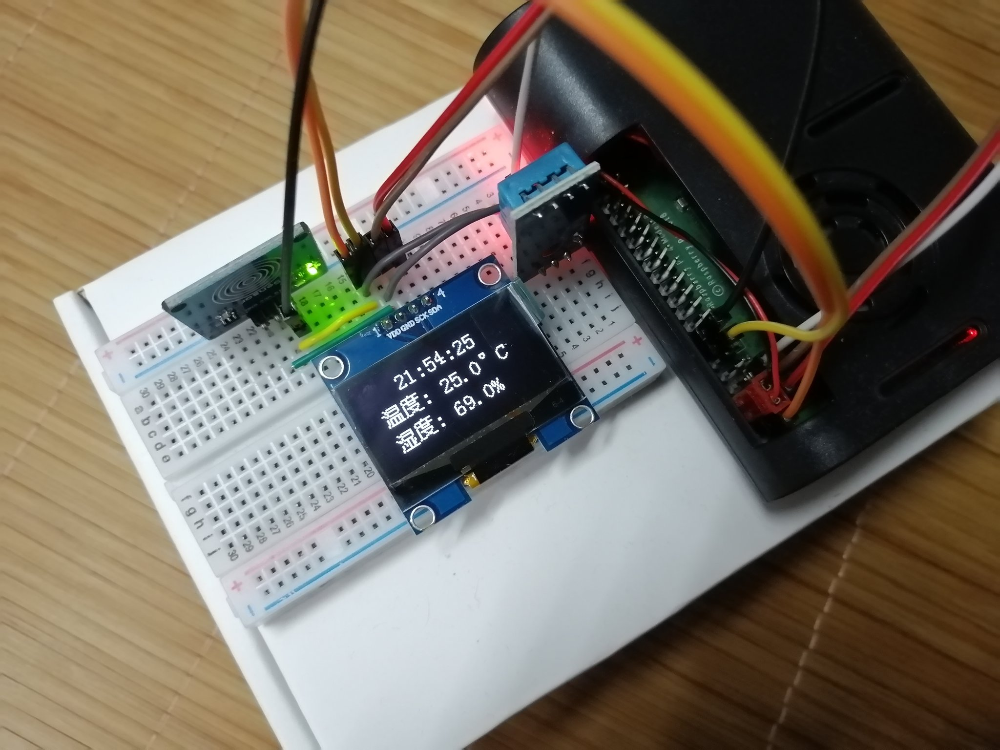
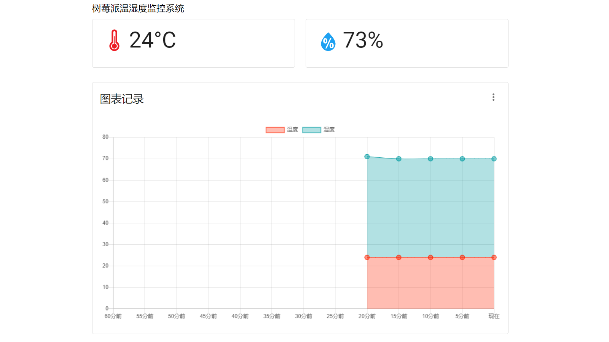

# 介绍

这是一个树莓派实时监测温湿度的项目，可通过 LED 显示屏和网页显示实时的温湿度记录

注意：本项目仍在完善中

## 硬件依赖

树莓派 4B | DHT11 传感器 | SH1106 显示器 | 触控传感器

## 软件依赖

- [luma.oled](https://github.com/rm-hull/luma.oled)

- [Adafruit_Python_DHT](https://github.com/adafruit/Adafruit_Python_DHT)

- [Pillow](https://github.com/python-pillow/Pillow)

- [bottle](https://github.com/bottlepy/bottle)

## 连接(以下接口均为 board 编号)

DHT11 DATA 接 Pin 7

sh1106 SCK 接 Pin 5, SDA 接 Pin 3

触控传感器 SIG 接 Pin 16

其余 VCC VDD GND 自行连接即可

## 使用方法

- 安装上述软件依赖并连接好硬件和树莓派

- 克隆本仓库并 `cd ./rpi-thermometer/web`

- 执行 `sudo python3 ./index.py` 启动硬件并开始自动记录数据

- 执行 `sudo python3 ./web.py` 启动网页

（如果一切顺利则效果应该如下“功能介绍”所示）

## 功能介绍

### 硬件

启动 `index.py` 后系统会自动与授时中心同步时间，同步结束后则开始测量和记录数据

默认且正常情况下每 10 秒测量一次温湿度并记录到 `data.json` 中，每 5 分钟记录一次数据到 `hour.json` 中，每 1 小时记录一次数据到  `halfDay.json` 中

系统每秒会检测触碰传感器的输入信号，在输入信号为低电平时显示器进入待机状态，当输入信号为高电平时显示器会显示实时时间和最近一次的测量结果

### 网页

网页脚本每 5 秒会读取一次 `data.json` 获取最近一次的测量结果并显示出来

利用 [Chart.js](https://github.com/chartjs/Chart.js) 将记录的数据绘制成图表记录，在右上角可选择数据的范围

## TODO

- Debug

- 扩大数据记录范围，优化图标显示逻辑
